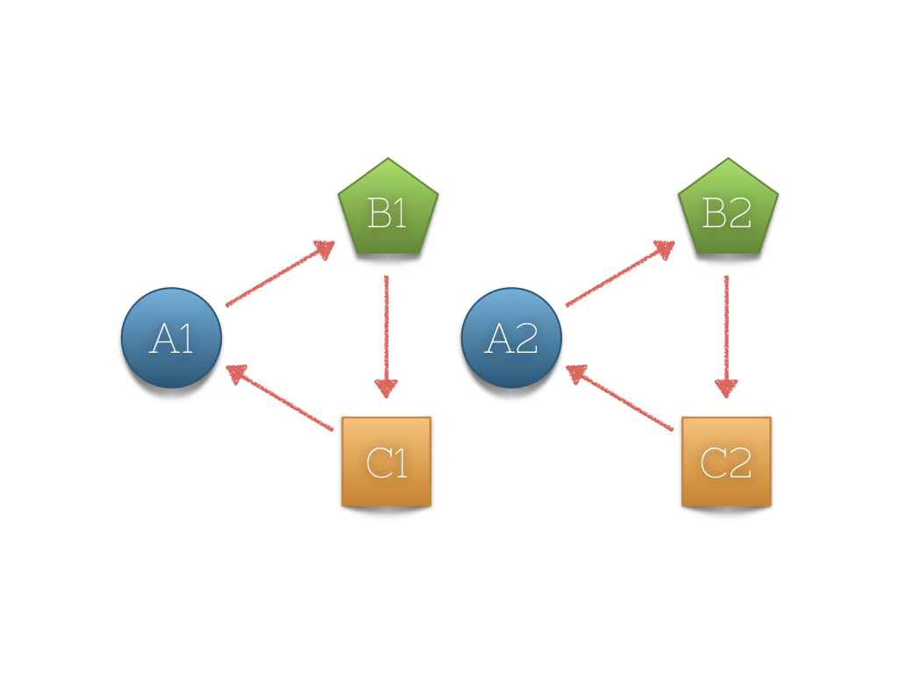
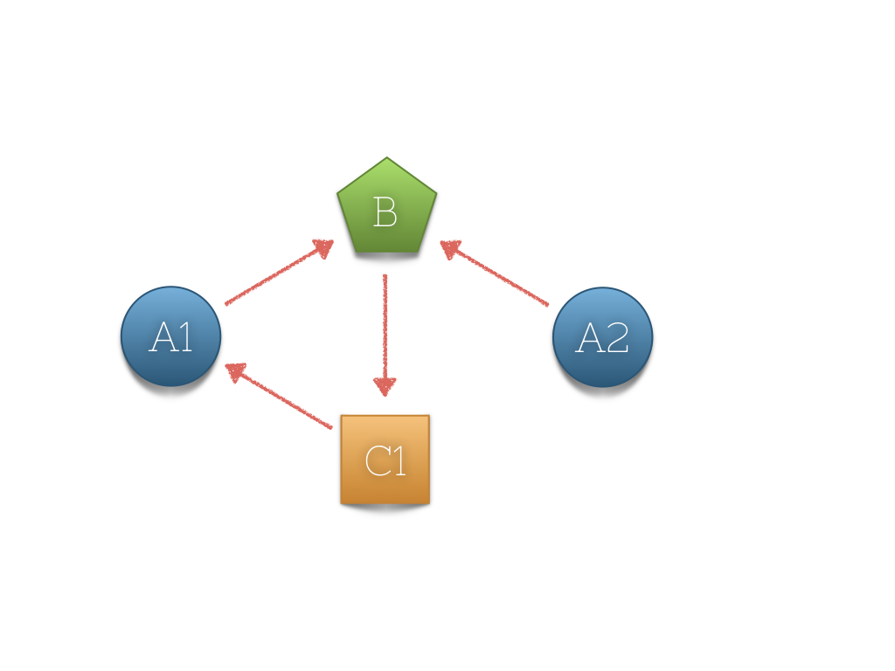
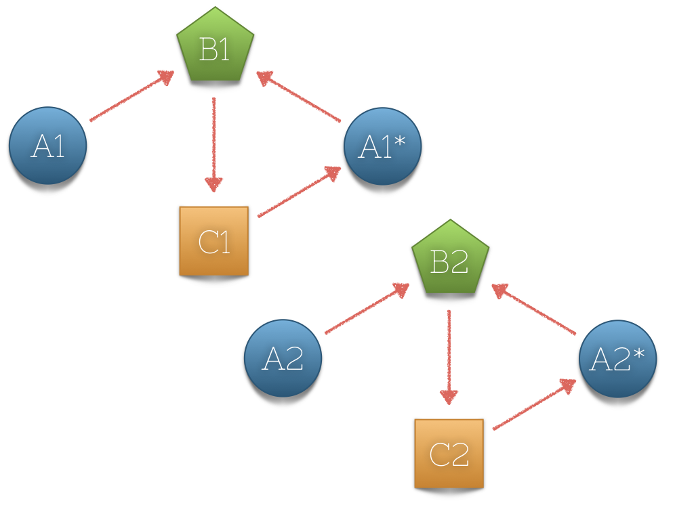

# EasyDi

[](https://travis-ci.org/AndreyZarembo/EasyDi)
[](http://cocoapods.org/pods/EasyDi)
[](https://github.com/Carthage/Carthage)
[](http://cocoapods.org/pods/EasyDi)
[](http://cocoapods.org/pods/EasyDi)
[](https://developer.apple.com/swift)


Effective DI library for rapid development in 200 lines of code.

## Requirements

Swift 3 or 4, iOS 8+

## Example

To run the example project, clone the repo, and run `pod install` from the Example directory first.

## Installation

EasyDi is available through [CocoaPods](http://cocoapods.org). To install
it, simply add the following line to your Podfile:

```ruby
pod "EasyDi"
```

## Author

Andrey Zarembo

e-mail: [andrey.zarembo@gmail.com](mailto:andrey.zarembo@gmail.com)

twitter: [@andreyzarembo](https://twitter.com/AndreyZarembo)

telegram: [@andreyzarembo](https://telegram.me/andreyzarembo)

## License

EasyDi is available under the MIT license. See the LICENSE file for more info.

## About

Dependency inversion is very important if project contains more than 5 screens and will be supported for more than a year.
Here are three basic scenarios where DI makes life better:

- **Parallel development**. One developer will be able to deal with UI, while another one will work with data layer. UI can be developed with test data, and the data layer can be called from the test UI.

- **Tests**. By substituting the network layer with stub responses, you can check all the options of UI behavior, including error cases.

- **Refactor**. The network layer can be replaced with a new, fast version with a cache and another API, if you leave the protocol with the UI unchanged.

The essence of DI can be described in one sentence: Dependencies for objects should be closed by the protocol and passed to the object when creating from the outside.
Instead of
```swift
class OrderViewController {
  func didClickShopButton(_ sender: UIButton?) {
    APIClient.sharedInstance.purchase(...)
  }
}
```
this approach should be used
```swift
protocol IPurchaseService {
  func perform(...)
}

class OrderViewController {
  var purchaseService: IPurchaseService?
  func didClickShopButton(_ sender: UIButton?) {
    self.purchaseService?.perform(...)
  }
}
```

More details with the principle of dependency inversion and the SOLID concept can be found [here](https://www.objc.io/issues/15-testing/dependency-injection/) and [here](https://en.wikipedia.org/wiki/SOLID_(object-oriented_design)).

EasyDi contains a dependency container for Swift. The syntax of this library was specially designed for rapid development and effective use. It fits in 200 lines, thus can do everything you need for grown-up DI library:

- Objects creation with dependencies and injection of dependencies into existing ones
- Separation into containers - Assemblies
- Types of dependency resolution: objects graph, singleton, prototype
- Objects substitution and dependency contexts for tests

There are no register / resolve methods in EasyDi. Instead of this, the dependencies are described like this:

```swift
var apiClient: IAPIClient {
  return define(init: APIClient()) {
    $0.baseURl = self.baseURL
  }
}
```

Due to this approach it is possible to resolve circular dependencies and use already existing objects.

## How to work with EasyDi (A simple example)

Task: move the work with the network from the ViewController to the services and place their creation and dependencies in a separate container.
This is a simple and effective way to begin dividing your application into layers. In this example we'll use the service and the viewcontroller from the above example.

PurchaseService:

```swift
protocol IPurchaseService {
  func perform(with objectId: String, then completion: (success: Bool)->Void)
}    

class PurchaseService {

  var baseURL: URL?
  var apiPath = "/purchase/"
  var apiClient: IAPIClient?

  func perform(with objectId: String, then completion: (_ success: Bool) -> Void) {

    guard let apiClient = self.apiClient, let url = self.baseURL else {
      fatalError("Trying to do something with uninitialized purchase service")
    }
    let purchaseURL = baseURL.appendingPathComponent(self.apiPath).appendingPathComponent(objectId)
    let urlRequest = URLRequest(url: purchaseURL)
    self.apiClient.post(urlRequest) { (_, error) in
      let success: Bool = (error == nil)
        completion( success )
    }
  }
}
```

ViewController:

```swift
class OrderViewController: ViewController {

  var purchaseService: IPurchaseService?
  var purchaseId: String?

  func didClickShopButton(_ sender: UIButton?) {

    guard let purchaseService = self.purchaseService, let purchaseId = self.purchaseId else {
      fatalError("Trying to do something with uninitialized OrderViewController")
    }

    self.purchaseService.perform(with: self.purchaseId) { (success) in
      self.presenter(showOrderResult: success)
    }
  }
}
```

Service dependencies assembly:

```swift
class ServiceAssembly: Assembly {

  var purchaseService: IPurchaseService {
    return define(init: PurchaseService()) {
      $0.baseURL = self.apiV1BaseURL
      $0.apiClient = self.apiClient
    }
  }

  var apiClient: IAPIClient {
    return define(init: APIClient())
  }

  var apiV1BaseURL: URL {
    return define(init: URL("http://someapi.com/")!)
  }
}
```

And this is how we inject the service in the viewcontroller:

```swift
class OrderViewAssembly: Assembly {

  lazy var serviceAssembly: ServiceAssembly = self.context.assembly()


  func inject(into controller: OrderViewController, purchaseId: String) {
    let _:OrderViewController = define(init: controller) {
    $0.purchaseService = self.serviceAssembly.purchaseService
    $0.purchaseId = purchaseId
    }
  }
}
```

Now you can change the class of the service without touching the OrderViewController code.   

## Dependency resolution types (Example of average complexity)

### ObjectGraph

By default, all dependencies are resolved through the graph of the objects. If the object already exists on the stack of the current object graph, it is used again. This allows us to inject the same object into several objects, and also allow cyclic dependencies. For example, consider the classes A, B and C with links A-> B-> C. (Do not pay attention to RetainCycle).

```swift
class A {
  var b: B?
}

class B {
  var c: C?
}

class C {
  var a: A?
}
```

This is how Assembly looks

```swift
class ABCAssembly: Assembly {

  var a:A {
    return define(init: A()) {
      $0.b = self.B()
    }
  }

  var b:B {
    return define(init: B()) {
      $0.c = self.C()
    }
  }

  var c:C {
    return define(init: C()) {
      $0.a = self.A()
    }
  }
}
```

and here is a dependency graph for two requests of A class instance

```swift
var a1 = ABCAssembly.instance().a
var a2 = ABCAssembly.instance().a
```


Two independent graphs were obtained.

### Singleton

But it happens that you need to create a single object, which will then be used everywhere, e.g.: the analytics system or the storage. We don't recommend to use well-known SharedInstance static property of Singleton class, since it will not be possible to replace it. For these purposes, there is a special scope in EasyDi: lazySingleton. The object with 'lazySingleton' scope is created once and its dependencies are injected once. Besides EasyDi does not change that object after creation. For example, we make a singleton of class B.

```swift
class ABCAssembly: Assembly {
  var a:A {
    return define(init: A()) {
      $0.b = self.B()
    }
  }

  var b:B {
    return define(scope: .lazySingleton, init: B()) {
      $0.c = self.C()
    }
  }

  var c:C {
    return define(init: C()) {
      $0.a = self.A()
    }
  }
}
```

```swift
var a1 = ABCAssembly.instance().a
var a2 = ABCAssembly.instance().a
```


This time, one object graph was obtained, because B instance became shared singleton.
Since we don't recreate (rebuild) objects with 'lazySingleton' scope, instance of B didn't change its dependencies after 'var a2 = ABCAssembly...'

### Prototype

Sometimes each request requires a new object. If we specify 'prototype' scope for the A class instance in our example we will get:

```swift
class ABCAssembly: Assembly {
  var a:A {
    return define(scope: .prototype, init: A()) {
      $0.b = self.B()
    }
  }

  var b:B {
    return define(init: B()) {
      $0.c = self.C()
    }
  }

  var c:C {
    return define(init: C()) {
      $0.a = self.A()
    }
  }
}
```

```swift
var a1 = ABCAssembly.instance().a
var a2 = ABCAssembly.instance().a
```


As a result two graphs of objects are created with 4 copies of object A

It is important to understand that the 'prototype' object is the entry point to the object graph. If you combine prototypes in a loop, the dependency stack will overflow and the application will fall.

## Substitutions and contexts for tests (A complex example)

When testing, it is important to maintain test independence. In EasyDi this property is provided by Assemblies contexts. For example, integration tests with singleton objects. Usage example:

```swift
let context: DIContext = DIContext()
let assemblyInstance2 = TestAssembly.instance(from: context)
```

It is important to ensure that peer assemblies have the same context.

```swift
class FeedViewAssembly: Assembly {

  lazy var serviceAssembly:ServiceAssembly = self.context.assembly()

}
```

Another important part of testing are mocks and stubs, that is, objects with defined behavior. With known input data, the object under the test produces a known result. If object does not produce it, then the test fails. More information about testing can be found [here](https://www.objc.io/issues/15-testing/). And here's how you can replace the dependency in the object to be tested:

```swift
//Production code
protocol ITheObject {
  var intParameter: Int { get }
}

class MyAssembly: Assembly {

  var theObject: ITheObject {
    return define(init: TheObject()) {
      $0.intParameter = 10
    }
  }
}

//Test code
let myAssembly = MyAssembly.instance()
myAssembly.addSubstitution(for: "theObject") { () -> ITheObject in
  let result = FakeTheObject()
  result.intParameter = 30
  return result
}
```

Now the theObject property will return stub object of another type with another intParameter.

The same mechanism can be used for A / B testing in the application. For example:

```swift
let FeatureAssembly: Assembly {

  var feature: IFeature {
    return define(init: Feature) {
      ...
    }
  }
}

let FeatureABTestAssembly: Assembly {

  lazy var featureAssembly: FeatureAssembly = self.context.assembly()

  var feature: IFeature {
    return define(init: FeatureV2) {
      ...
    }
  }

  func activate(firstTest: Bool) {
    if (firstTest) {
      self.featureAssembly.addSubstitution(for: "feature") {
        return self.feature
      }
    } else {
      self.featureAssembly.removeSubstitution(for: "feature")
    }
  }
}
```

In this example a separate container is created for the test. That container creates a second variant of the feature and allows to enable / disable the substitution of the feature.

## Dependency injection in the VIPER (Complex example)

It happens that it is necessary to inject dependencies into an existing object, while some other objects depend on it. The simplest example is VIPER, when the Presenter should be added to the ViewController, and it should get a pointer to the ViewController itself.

For this case, EasyDi has 'keys' with which you can return the same object from different methods. It looks like this:

```swift
сlass ModuleAssembly: Assembly {

  func inject(into view: ModuleViewController) {
    return define(key: "view", init: view) {
      $0.presenter = self.presenter
    }
  }

  var view: IModuleViewController {
    return definePlaceholder()
  }

  var presenter: IModulePresenter {
    return define(init: ModulePresenter()) {
	    $0.view = self.view
      $0.interactor = self.interactor
    }
  }

  var interactor: IModuleInteractor {
    return define(init: ModuleInteractor()) {
	    $0.presenter = self.presenter
      ...
    }
  }
}
```

Here, to implement dependencies in the ViewController, the inject method is used, which is linked by the key with the 'view' property. Now, this property returns the object passed to the 'inject' method. Thus, the VIPER module assembly is initiated with 'inject' method.
